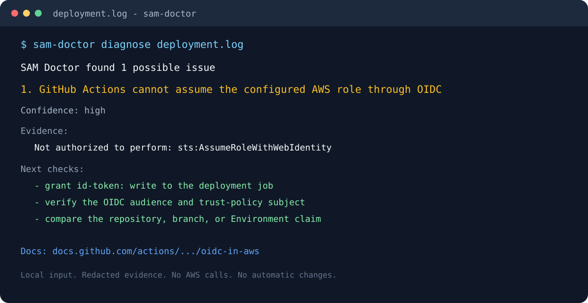

# SAM Doctor

[](https://github.com/jakegold1647/sam-doctor/actions/workflows/ci.yml)
[](LICENSE)
[](https://www.python.org/)
[](https://github.com/marketplace/actions/sam-doctor-aws-deployment-diagnostics)
[](https://pypi.org/project/sam-doctor/)
[](https://github.com/jakegold1647/sam-doctor/releases)

**Find the next useful step in a failed AWS deployment - without uploading your
logs or granting AWS access.**

SAM Doctor reads AWS SAM, CloudFormation, IAM, and GitHub Actions deployment
logs locally. It identifies supported failure patterns and returns short,
redacted evidence, safe checks, and the relevant official documentation.

**[See the project page](https://jakegold1647.github.io/sam-doctor/)** |
**[Use on GitHub Marketplace](https://github.com/marketplace/actions/sam-doctor-aws-deployment-diagnostics)** |
**[Report a bad diagnosis](https://github.com/jakegold1647/sam-doctor/issues/new/choose)** |
**[Request a rule](https://github.com/jakegold1647/sam-doctor/issues/new/choose)** |
**[Join the feedback discussion](https://github.com/jakegold1647/sam-doctor/discussions/1)**

It does **not** access AWS, upload logs, change resources, or promise an
authoritative root cause. It detects known patterns in the text you provide,
redacts common identifiers, and gives safe verification steps and the relevant
official documentation.

Current release: **v0.7.7**.

## Who this is for

- Use this tool if you need a fast local first pass when a SAM/CloudFormation/GitHub
  Actions deployment fails.
- Skip it if you need account-state inspection, drift analysis, quota checks, or
  automatic fixes.
- It is most useful for actionable deployment logs with explicit error lines and
  rollback context.

## Try it in 60 seconds

```bash
python -m pip install sam-doctor
sam-doctor demo
```

The bundled demo needs no AWS credentials and makes no network calls. It
prints a real report:

```text
SAM Doctor found 1 possible issue(s) in oidc-assume-role-failure.txt.

1. GitHub Actions cannot assume the configured AWS role through OIDC (high confidence)
   Matched on line: 1
   The workflow reached AWS STS but the role trust relationship did not accept
   the GitHub-issued OIDC token. ...
   Evidence:
   - Error: Not authorized to perform: sts:AssumeRoleWithWebIdentity
   Verify:
   - Confirm the workflow or job permissions include `id-token: write`.
   - Check that the role trust policy accepts `token.actions.githubusercontent.com:aud`
     equal to `sts.amazonaws.com`.
   Docs: https://docs.github.com/actions/how-tos/secure-your-work/security-harden-deployments/oidc-in-aws
```

To diagnose a real deployment log:

```bash
sam-doctor diagnose deployment.log
```

`pip` installs the latest stable release from PyPI. Other install paths that
work the same way:

```bash
pipx install sam-doctor      # isolated global CLI
uvx sam-doctor demo          # run without installing
```

To pin the tested release exactly, use `sam-doctor==0.7.7`; to install from
the tagged source instead:

```bash
python -m pip install "sam-doctor @ git+https://github.com/jakegold1647/sam-doctor.git@v0.7.7"
```

If your shell cannot find `sam-doctor` after installation, activate the
environment where it was installed or use `python -m sam_doctor.cli` in the
commands below.

## 60-second first response checklist

Use this when a teammate posts an error:

```bash
sam-doctor diagnose deployment.log --format markdown
```

If you need a quick signal from pasted text, skip the file step:

```bash
printf '%s\n' "Your pasted AWS failure excerpt" | sam-doctor diagnose -
```

Then reply with this pattern:

1. Quote the top finding (or say none supported yet).
2. Include one safe verification command from the report.
3. Ask for one follow-up: did that check pass?

If the tool did not match the failure and this was a real production issue, open
`Report a bad diagnosis` immediately and include a short, sanitized excerpt plus
the command you ran.



## Current free core

- GitHub Actions OIDC errors: missing `id-token: write`, audience mismatch,
  trust-policy/subject mismatch, and `AssumeRoleWithWebIdentity` failures
- IAM `AccessDenied` failures
- CloudFormation failed-resource events and rollback states
- CloudFormation capability acknowledgement errors
- Lambda container-image failures caused by missing ECR image access
- API Gateway deployments created before methods exist
- SAM deployment/configuration errors, including conflicting artifact-bucket settings
  and missing `esbuild` dependencies
- Template shape, IAM trust-policy, Lambda packaging, and S3 artifact failures
- API Gateway CORS preflight conflicts
- Terminal, Markdown, and JSON reports
- Composite GitHub Action with opt-in redacted job summaries and CI gating
- Local redaction for account IDs, ARNs, email addresses, and common CI credentials

For more bundled examples, try `sam-doctor demo --scenario cloudformation`,
`sam-doctor demo --scenario api-gateway`, or `sam-doctor demo --scenario esbuild`.
Run `sam-doctor rules --format json` to inspect the exact set of supported
diagnostic categories before sharing a log.

To save a report:

```bash
sam-doctor diagnose deployment.log --format markdown --output diagnosis.md
```

The input can also be read from standard input, which is useful for CI steps and
shell pipelines:

```bash
kubectl logs deploy/my-api | sam-doctor diagnose -
sam-doctor diagnose deployment.log --format json --output diagnosis.json
```

The terminal format is intended for a quick local check, Markdown is convenient
for a human-readable handoff, and JSON is stable enough for scripts and CI
annotations. All three formats include the first matching line number and matched
evidence, not the full input log.

### CLI exit codes

- `0`: command completed successfully.
- `1`: command input could not be read, arguments were invalid, or `--fail-on-findings`
  found supported matches (for `diagnose` or `batch`).

You can also process multiple files in batch mode:

```bash
sam-doctor batch logs/*.log logs/*.txt --format json > batch-results.json
```

For a shell-based CI gate, add `--fail-on-findings`. The command still writes
the report, then exits with status 1 only when a supported finding is present:

```bash
sam-doctor diagnose deployment.log --format json \
  --output diagnosis.json --fail-on-findings
```

For multi-file CI input:

```bash
sam-doctor batch logs/*.log logs/*.txt --format json \
  --output batch-results.json --fail-on-findings
```

## GitHub Actions

Use the included action when a workflow already saves a deployment log:

```yaml
- name: Deploy
  shell: bash
  run: |
    set -o pipefail
    sam deploy --no-confirm-changeset 2>&1 | tee deployment.log

- name: Diagnose deployment log
  if: always()
  id: sam-doctor
  uses: jakegold1647/sam-doctor@v0.7.7
  with:
    log-file: deployment.log
    summary: true
    # Uncomment to fail this job when a supported finding is detected.
    # fail-on-findings: true
```

Use this ready-to-copy starter workflow as your starting point:

```bash
curl -L https://raw.githubusercontent.com/jakegold1647/sam-doctor/main/examples/github-actions-workflow.yml -o .github/workflows/sam-doctor.yml
```

### 90-second onboarding by stack type

- **AWS SAM deploy command**
  - Start with [`examples/github-actions-workflow.yml`](examples/github-actions-workflow.yml)
- **AWS SAM sync workflows**
  - Start with [`examples/github-actions-workflow-sam-sync.yml`](examples/github-actions-workflow-sam-sync.yml)
- **CloudFormation package/deploy commandline**
  - Start with [`examples/github-actions-workflow-cf-pipeline.yml`](examples/github-actions-workflow-cf-pipeline.yml)

You can also use the examples index to track what you changed:

[`examples/README.md`](examples/README.md)

## Non-GitHub CI starter templates

If your repo uses another CI system, copy:

- GitLab: [`examples/gitlab-ci-sam-doctor.yml`](examples/gitlab-ci-sam-doctor.yml)
- CircleCI: [`examples/circleci-sam-doctor.yml`](examples/circleci-sam-doctor.yml)

Put the diagnostic step after the command that writes the log and keep
`if: always()`; otherwise GitHub Actions skips it when the deployment fails.
The action exposes `finding-count` and `has-findings` outputs. Set
`fail-on-findings: true` only when you want a supported diagnostic to fail
the job; the commented line above shows the opt-in placement. The Markdown job
summary is opt-in and contains only matched, redacted
evidence; review it before sharing a workflow run outside your team. The action also adds one redacted GitHub Actions notice for the first finding by default; set `annotations: "false"` to disable it.

You can also adapt the full example from
[`examples/github-actions-workflow.yml`](examples/github-actions-workflow.yml).

## What a report includes

SAM Doctor deliberately reports only what its rules can support:

1. A likely failure category and confidence level.
2. Up to three matched log lines, redacted before output.
3. Safe checks to validate the diagnosis before changing a policy or stack.
4. A link to the relevant official documentation.

It is most useful when you start with the first failure in a deployment log,
not a later rollback message. When multiple supported patterns appear, SAM
Doctor presents findings in the order of their first matching log line.

## How it compares

- **vs. reading the log yourself.** For a failure you have seen before, just
  read the log. SAM Doctor helps when the useful line is buried under rollback
  noise, or when the error text (OIDC trust-policy mismatches especially) does
  not say what to check next. It finds the first supported failure signal and
  pairs it with the verification steps and the official doc page.
- **vs. pasting the log into an LLM.** An LLM can reason about failures SAM
  Doctor has no rule for, and that is sometimes the right call. The trade-offs:
  you upload the log (deployment logs routinely contain account IDs, ARNs, and
  role names), the answer varies run to run, and it may be confidently wrong.
  SAM Doctor is deterministic, runs offline, and redacts by default - and when
  it has no matching rule, it says so instead of guessing. Using it first and
  an LLM for the leftovers is a reasonable workflow.
- **vs. AWS Support.** Support can see your account state; SAM Doctor cannot
  and does not try. It is the two-minute local check you run before deciding
  whether a ticket is worth opening, and its redacted report is a safer
  artifact to paste into one.

## When not to use this

- The failure is in application runtime behavior, not the deployment itself -
  this reads deployment logs, not CloudWatch application logs.
- You need account-state inspection (drift, quotas, existing resources). SAM
  Doctor never calls AWS, by design.
- Your failure is outside the [supported rules](#supported-signals) - you get
  an honest "no supported pattern found", not a guess.
- You want an automatic fix. Every report is a prompt to verify, not a
  change to apply.

## Feedback and roadmap

The free core will stay useful for individual deployment failures. Please open
an issue when a report is wrong, unclear, or missing a failure pattern. For a
new rule, include only a sanitized error excerpt and the safe next check you
expected to see. See [CONTRIBUTING.md](CONTRIBUTING.md) for the exact format.

## Guides

- [Add SAM Doctor to an existing GitHub Actions deployment](docs/github-actions-integration.md)
- [Fix "Not authorized to perform: sts:AssumeRoleWithWebIdentity" in GitHub Actions](docs/oidc-deployment-debugging.md)
- [Find the first useful error in a CloudFormation ROLLBACK_COMPLETE](docs/cloudformation-first-failure.md)
- [Fix "InsufficientCapabilitiesException" in an AWS SAM deployment](docs/capability-acknowledgement.md)

## Supported signals

Run `sam-doctor rules` for the current machine-readable catalog. Each rule is
triggered by an explicit error signal, not by template inspection or AWS account
access; the report is still a prompt to verify the cause, not an automatic fix.

## Scope and safety

Run this only on logs you are authorized to inspect. Review every suggested
command and policy change before applying it. SAM Doctor is diagnostic help,
not security, legal, or production-operations advice.

Reports redact AWS account IDs, ARNs, email addresses, common AWS access key IDs,
bearer tokens, JWT-style tokens, and common GitHub token formats before matched
evidence or a displayed source name is shared. This is a helpful guardrail, not a secret scanner:
review a report before sharing it.

## Development

```bash
python -m pip install -e ".[dev]"
python -m pytest -q
python -m build
```

See [CHANGELOG.md](CHANGELOG.md) for release history, [SECURITY.md](SECURITY.md)
for vulnerability reporting, [SUPPORT.md](SUPPORT.md) for help boundaries, and
[docs/pypi-publishing.md](docs/pypi-publishing.md) for the stable-release
publishing setup.
